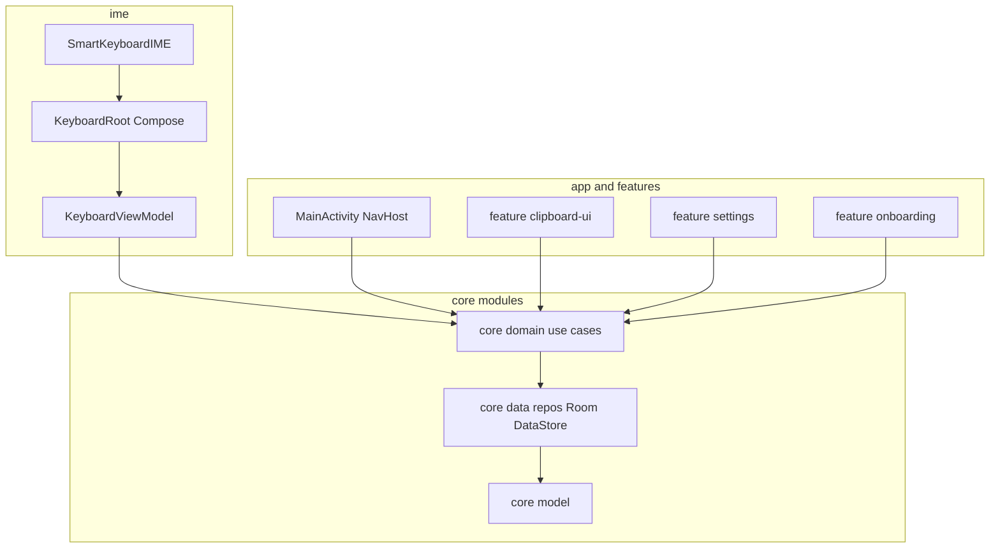

# SmartBoard — Complete implementation plan

This document is the **authoritative build spec**: follow the **critical build order** (phases compile and run on device/emulator before advancing). Product name: **SmartBoard**.

---

## Critical build order (do not skip)

| Phase | Gate |
|-------|------|
| **PHASE 0** | Foundation compiles; **IME shows EN QWERTY on device** before any hero feature |
| **PHASE 1** | Clipboard + pinned bar exceptional UX; list search/swipe/pin/categories |
| **PHASE 2** | Emoji, themes, keyboard ergonomics, suggestions, Bangla layout |
| **PHASE 3** | Onboarding, full settings, voice, GIF; **swipe/glide typing only here** |

**PHASE 0 (Foundation)**

1. Project structure + **all Gradle modules** (exact list below) + `gradle/libs.versions.toml`
2. **Hilt** (`SmartBoardApp`, `@HiltAndroidApp`, entry points for IME if needed)
3. **Room + DataStore** wired through repositories (no Main-thread IO)
4. **IME shell** (`InputMethodService` + Compose host) — **device test first**
5. **Basic EN QWERTY** renders inside IME

**PHASE 1 (Hero)**

6. Clipboard capture: **`OnPrimaryClipChangedListener` only** (registered `onWindowShown`, removed `onWindowHidden`); respect `clipboard_read_mode` (`ON_OPEN` vs while visible — implement as documented in settings)
7. Clipboard history panel: list, **FTS** search, swipe-delete, categories, empty/loading states
8. **Pinned bar** above keys (horizontal scroll, one-tap paste) — max polish
9. Pinned text manager: create, edit, rename, delete, **reorder** (persist `sort_order`)

**PHASE 2 (Keyboard)**

10. Emoji picker + emoji search + recent (40) / favorites in DataStore JSON
11. Themes: dark / light / **AMOLED** / customaccent grid (Blue/Purple/Green) + optional advanced color
12. Number row, height scale (0.8–1.3), haptics, key sounds, one-hand mode
13. Suggestions strip via **`SpellCheckerSession`**
14. **Bangla** layout + **Avro phonetic**-style composer (reference: [mugli/avro.js](https://github.com/mugli/avro.js) logic ported to Kotlin — data-driven `KeyboardLayout` / `KeyDef`)

**PHASE 3 (Polish + media + glide)**

15. Onboarding (4 screens) + `onboarding_complete`
16. Settings (all categories, NavHost in `:feature:settings`)
17. Voice: **`SpeechRecognizer`**
18. GIF: **Tenor API**, gated by `network_gif_enabled`
19. **Swipe/glide typing** — **do not start before this phase**

---

## Gradle modules (exact)

- `:app` — `SmartBoardApp.kt`, `MainActivity.kt`, `navigation/AppNavGraph.kt`, hosts onboarding + “Enable keyboard” CTA
- `:ime` — `SmartKeyboardIME`, `ui/*`, `layouts/*`, keyboard panels
- `:feature:settings` — `SettingsNavGraph.kt` + all settings screens listed below
- `:feature:onboarding` — 4 pages + system settings deep-links
- `:feature:clipboard-ui` — `ClipboardPanel`, list item, search bar, category chips (shared IME + standalone manager)
- `:core:model` — domain models, **sealed UI states**, enums — **no Android dependencies**
- `:core:domain` — use cases (clipboard, pins, settings, backup/import/export)
- `:core:data` — Room, DataStore, repositories, mappers, `ClipboardClassifier`
- `:core:ui` — theme tokens, components, fonts (DM Sans, Inter), animations
- `:core:common` — `CoroutineDispatchers`, `Result`, `TimeProvider`

**Version catalog:** all dependency versions live in [`gradle/libs.versions.toml`](gradle/libs.versions.toml) (user-pinned versions: Kotlin 2.0.0, AGP 8.5.0, Compose BOM 2024.06.00, Hilt 2.51.1, Room 2.6.1, DataStore 1.1.1, Navigation 2.7.7, Coil 2.6.0 — adjust only if AGP/Studio requires).

**Clean Architecture rule:** `:core:model` stays JVM-only. **Do not** put `ImageVector` or `Context` in model; map `ClipboardCategory` → icons in `:core:ui` or `:ime`.

---

## Room database

- **File:** `smartboard_database.db`
- **Version:** 1

### `clipboard_entries` + FTS

Use Room `@Entity`, `@Dao`, `@Database`; mirror this schema:

- `id` INTEGER PK AUTOINCREMENT
- `content_text` TEXT NOT NULL
- `content_hash` TEXT NOT NULL (SHA-256 for dedup / merge logic)
- `category` TEXT NOT NULL DEFAULT `PLAIN` — `LINK | EMAIL | PHONE | PLAIN | OTHER`
- `is_pinned` INTEGER NOT NULL DEFAULT 0
- `is_favorite` INTEGER NOT NULL DEFAULT 0
- `created_at` INTEGER NOT NULL
- `last_used_at` INTEGER NOT NULL
- `usage_count` INTEGER NOT NULL DEFAULT 0

**Indices:** `idx_clipboard_created` on `created_at`, `idx_clipboard_category` on `category`.

**FTS4:** virtual table `clipboard_fts` with `content_text`, `content='clipboard_entries'`, `tokenize='unicode61'` — use Room FTS4 support or raw `@RawQuery` sync; **search UI uses MATCH**.

### `pinned_snippets`

- `id` PK, `title` (≤30 enforced in UI/domain), `body`, `sort_order` (0-based), `created_at`, `updated_at`

### Domain/use cases (`:core:domain`)

Implement (names align with user spec): `ObserveClipboardUseCase`, `SaveClipboardEntryUseCase`, `DeleteClipboardEntryUseCase`, `SearchClipboardUseCase`, `PinClipboardEntryUseCase`, `ObservePinsUseCase`, `SavePinUseCase`, `DeletePinUseCase`, `ReorderPinsUseCase`, `ObserveSettingsUseCase`, `UpdateSettingUseCase`, `ExportPinsUseCase`, `ImportPinsUseCase` (+ merge strategy on import).

---

## DataStore (`settings_preferences`)

| Key | Type | Default |
|-----|------|---------|
| `clipboard_enabled` | Boolean | true |
| `clipboard_max_entries` | Int | 200 (cap 200) |
| `clipboard_read_mode` | String | `ON_OPEN` — values `ON_OPEN \| BACKGROUND` |
| `pinned_bar_visible` | Boolean | true |
| `theme_mode` | String | `SYSTEM` — `LIGHT \| DARK \| AMOLED \| SYSTEM` (+ custom accent keys as needed for theme grid) |
| `keyboard_height_scale` | Float | 1.0 (0.8–1.3) |
| `number_row_enabled` | Boolean | false |
| `haptic_enabled` | Boolean | true |
| `sound_enabled` | Boolean | false |
| `one_hand_mode` | String | `OFF` — `LEFT \| RIGHT` |
| `active_language` | String | `en` / `bn` |
| `network_gif_enabled` | Boolean | true |
| `onboarding_complete` | Boolean | false |

Add toggles from settings screens as needed (`auto_categorize`, key border style, haptic intensity, sound volume, etc.) without bloating P0 — extend DataStore schema in versioned steps.

---

## IME service — implementation contract

**File:** `ime/.../SmartKeyboardIME.kt`

- Use **`AbstractComposeView` / dedicated `ComposeInputView`** pattern so window token and lifecycle are correct; **do not** use Activity `setContentView`.
- **Clipboard:** `OnPrimaryClipChangedListener` reads **`primaryClip`** inside the callback; **never** poll clipboard in background workers.
- Register listener in **`onWindowShown`**, remove in **`onWindowHidden`** (matches user spec).
- Expose `commitText` / `sendBackspace` via `currentInputConnection` helpers used by ViewModel/UI.

**Manifest:** `BIND_INPUT_METHOD` service + `@xml/method` meta-data; `method.xml` includes **English** + **বাংলা** subtypes (`en_US`, `bn_BD`), `android:settingsActivity` → `MainActivity`.

**Note:** On newer Android versions, clipboard access may still be restricted when IME not focused; the listener while the IME window is shown is the intended compromise; `clipboard_read_mode` may gate whether listener is active whenever visible vs only after opening clipboard panel (`ON_OPEN`).

---

## Design system — implement exactly (`:core:ui`)

### Colors

Map user palette to **Material 3 `ColorScheme` / custom `SmartBoardColors`**; **never hardcode** in feature modules — expose via theme:

- Light: `KeyboardBackground` `#EEF0F4`, `KeySurface` `#FFFFFF`, `KeySurfaceSpecial` `#D1D5DB`, `KeySurfaceAccent` `#4285F4`, `KeyText` `#1A1A2E`, `SuggestionBar`, `PinnedBarBg`, `PinnedChipBg`, active chip on accent, clipboard + category chips as spec
- Dark: `#1A1A1A` backgrounds, `#2D2D2D` keys, etc.
- AMOLED: `#000000` / `#111111`

### Typography

- **DM Sans** — keys + pinned labels (`KeyTextStyle`, `KeyTextStyleSmall`, `PinnedLabelStyle`)
- **Inter** — suggestions + clipboard body (`SuggestionTextStyle`)
- Load via `google-fonts` / downloadable fonts Compose API

### Keys

- Height **46dp**, radius **8dp**, shadow `Modifier.shadow` (not elevation): 0,1,2 blur, black 12%; press scale **0.94** spring stiffness **400**, damping **0.7**; press color shift (light +4% / dark -8%)
- Long-press popup: **52×48** above key, **80ms** appear
- Space: pill **20dp** radius, ~**40%** width, subtle **“SmartBoard”** label (string resource)
- Special keys: **Material Symbols Rounded** weight 300; `KeySurfaceSpecial`
- Optional number row: **36dp**, primary **13sp**, secondary **9sp**

### Pinned bar (hero)

- Container **44dp**, bg `PinnedBarBg`, **1dp** bottom divider `#E0E0E0`, padding **8dp** / **6dp**
- Row: **pin toggle** (20dp) → `LazyRow` chips (gap **6dp**) → **+** (32dp circle outlined)
- Chip: **32dp** tall, pill **16dp**, `PinnedLabelStyle`, **max 20 chars** ellipsis
- Tap: `commitText(body)` + brief scale to **0.96** spring; active: accent bg + white text
- Long-press sheet: Paste / Edit / Move to first / Delete
- New pin: **slide-in from right**

### Clipboard panel

- Replaces key grid height; **16dp** top radius; slide **up 280ms** FastOutSlowIn, down **200ms**
- Header 40dp: title + search + clear-all + close; optional search row **40dp** with FTS live filter
- Category chips row **36dp**: All, Links, Emails, Phones, Text
- `LazyColumn` items: category icon, 2-line Inter preview, pin + timestamp, **swipe** delete (red) / pin (accent) — Material3 `SwipeToDismiss` or custom
- Pinned rows: **3dp** accent left border + filled pin icon
- Empty state: illustration + copy from strings
- New item: **fade + translateY(-8dp) 200ms**

### Emoji panel

- Same slide animation; tabs row **36dp** (Recent, categories…); **8-column** grid **40dp** cells, **24sp** emoji; tap commits text, panel stays open; long-press skin tones; recent **40** in DataStore JSON; favorites starred

### Settings & onboarding

- **Settings:** single `NavHost` with screens: Clipboard, Appearance, Pinned manager (FAB, drag-drop reorder), Languages, One-hand, Privacy, Backup/Restore, About — controls as user described (sliders, toggles, destructive confirms, SAF export/import, optional settings JSON)
- **Onboarding:** 4 screens — Welcome, Privacy, Enable keyboard (`Settings.ACTION_INPUT_METHOD_SETTINGS`), Set default (`showInputMethodPicker`), progress dots, skip top-right 1–3, completion sets `onboarding_complete`

---

## Clipboard classifier (`:core/data`)

- Regex classification using `Patterns.WEB_URL`, `EMAIL_ADDRESS`, `PHONE` with rules from user spec; **`classifyAsync` on `Dispatchers.Default`**.
- **Dedup:** use `content_hash` (SHA-256) to skip duplicate consecutive entries or merge usage counters.

---

## Animations

Implement all user-listed patterns: key press spring (`graphicsLayer` scale), panel `Animatable` offset + `tween` easings, clipboard item `AnimatedVisibility` enter, pinned chip `animateFloatAsState`, theme `animateColorAsState` for scheme transitions, swipe dismiss backgrounds.

---

## Haptics (`HapticsManager` in `:core:ui` or `:ime`)

- Key tap: `EFFECT_TICK` API 29+; legacy short vibrate
- Special keys: `EFFECT_CLICK` — respect `haptic_enabled` and future intensity pref

---

## Backup / restore

- `SmartBoardBackup` JSON `version`, `exportedAt`, `pinnedSnippets`, optional `settings`
- SAF: `ACTION_CREATE_DOCUMENT` / `ACTION_OPEN_DOCUMENT`, `application/json`
- Filename pattern `smartboard_backup_<timestamp>.json` — encryption/Keystore deferred v2

---

## Performance gates

- IME first frame **< 200ms** after show (profile; minimize composition, defer non-critical work)
- 200 clipboard rows: **`LazyColumn` + `key { item.id }`**, `derivedStateOf` for filters
- **No** Room/DataStore on Main; classification/DB on **IO/Default**
- GIF thumbs: **Coil** + size constraints

---

## Folder structure (exact package layout)

Use **SmartBoard/** root with:

- `app/src/main/kotlin/com/smartboard/app/` — `SmartBoardApp.kt`, `MainActivity.kt`, `navigation/AppNavGraph.kt`
- `ime/src/main/kotlin/com/smartboard/ime/` — `SmartKeyboardIME.kt`, `ui/` (root, VM, state, `keys/`, `panels/`, `suggestions/`, `pinnedbar/`), `layouts/` (`EnglishLayout.kt`, `BanglaLayout.kt`)
- `feature/settings/...`, `feature/onboarding/...`
- `feature/clipboard-ui/...` — shared clipboard UI
- `core/{model,domain,data,ui,common}/...` per user tree (`domain/clipboard`, `domain/pins`, `domain/settings`, `data/db`, `data/datastore`, `data/repository`, `data/classifier`, `ui/theme`, `ui/components`)

---

## Engineering rules (Cursor / Composer)

1. **100% Compose** for UI — no XML layouts (resources: manifest, xml/method, strings, drawables OK)
2. **No hardcoded colors** in features — theme tokens only
3. **No Main dispatcher** for Room/DataStore
4. **Clipboard read only** via listener path (plus explicit panel-open flows if `ON_OPEN`); no background polling
5. **`key { item.id }`** on lazy lists
6. **Sealed classes** for list/load/error/empty UI state
7. Every list: **loading + empty** states
8. **IME shell must run on device** before further phases
9. **Pinned bar** gets highest UX polish priority
10. Bottom sheets/dialogs: **BackHandler** / proper dismiss
11. Material3 base + **CompositionLocal** overrides for SmartBoard
12. **All user-visible strings** in `res/values/strings.xml` (and translated when needed)
13. **RTL** from day one (`LocaleListComposition`, mirroring, semantics)
14. Test **API 26** and **API 34+**

---

## Architecture diagram

---

## Execution strategy for the agent

1. Generate empty multi-module project + catalog + CI-friendly `compileDebug` per phase
2. After **Phase 0**, install on emulator; set SmartBoard as IME; type in a note app
3. Land Phase 1 behind feature flags if needed; measure jank with GPU profiler
4. Phase 2: theme tokens first, then emoji (large string data can ship as asset)
5. Phase 3: onboarding/settings then network features; **glide last** with isolated `GestureTracer` + engine module

---

## Risk notes

- **FTS + content sync:** Room FTS maintenance triggers must stay correct on insert/update/delete
- **Avro phonetic:** treat as state machine + dictionary table; start minimal (common conjuncts) and extend
- **Tenor:** API key in `local.properties` / BuildConfig, never commit secrets

